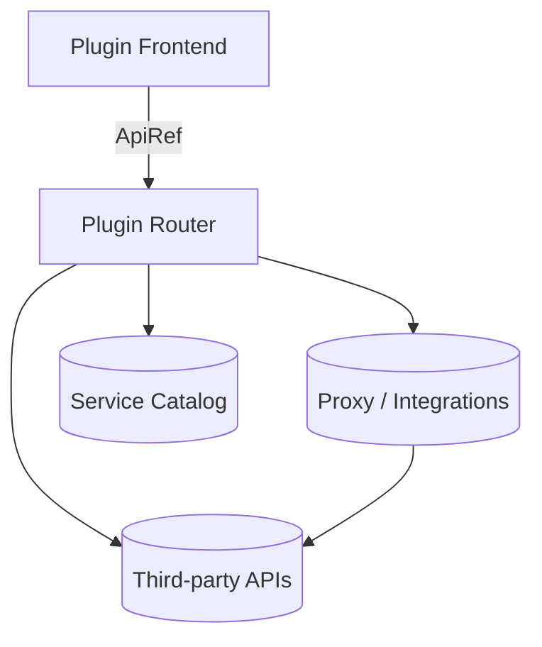

# Level Up Your Hackathon Game
Empowering Engineering Teams with Backstage

---
layout: center
---

# Who am I

---

# Agenda

- What and why Backstage
- Quick overview about Architecture
- Hands-on workshop

---

# What Is Backstage?

- Created by Spotify and released as open source
- Incubated at the CNCF (Cloud Native Computing Foundation) with an active community and vendors
- Used by Spotify, Expedia, American Airlines, [and many others](https://github.com/backstage/backstage/blob/master/ADOPTERS.md)
- An open-source Internal Developer Portal that unifies the service catalog, documentation, and self-service tooling
- Built as an extensible platform: React frontend, Node.js backend, and a TypeScript plugin ecosystem

<!--
This slide spells out Backstage as an extensible internal developer portal that acts as the foundation of a developer platform. Emphasize the open-source nature, plugin flexibility, and the "single front door" value for developers.
-->

---

# Why Does Backstage Matter?

- Finding documentation and ownership for a service/app often consumes a lot of time
- Onboarding depends on informal, cross-team knowledge transfer
- Reduces tool confusion by simplifying access to pipelines, infrastructure, and the knowledge base
- Becomes the single entry point for developers to find service context and access third-party integrations

<!--
We all struggle with scattered information and inconsistent tooling. Backstage offers a structured approach so platform teams can provide clean self-service experiences.
-->

---

# Core Features and Demo

- **Service Catalog** stores the list of services, owners, and metadata
- **Software Templates (Scaffolder)** automate repo creation, infrastructure, and guardrails from day zero
- **TechDocs** keeps technical documentation next to every component
- **Unified search** indexes the catalog, documentation, and plugins
- **Plugins & Plugins Martketplace** expose community integrations as well as internal solutions

<!--
Add a screenshot that highlights the core features on this slide
-->

---

# Software Catalog

- Primary entities: `Component`, `API`, `Resource`, `System`, `Domain`, `User`, `Group`
- Every entity stores metadata, spec, and relationships to describe dependencies
- Processors scan repositories, external catalogs, or `catalog-info.yaml` files
- Annotations (`metadata.annotations`) link additional integrations
- Catalog policies validate metadata compliance

<!--
The Software Catalog is Backstage's heart. Defining entities and their relationships gives teams cross-org visibility and lets us attach integrations through annotations and policy.
-->

---

# Example `catalog-info.yaml`

```yaml
apiVersion: backstage.io/v1alpha1
kind: Component
metadata:
  name: payments-service
  description: Internal payments service
  tags: [node, payments]
  annotations:
    backstage.io/techdocs-ref: dir:.
    monitoring.gatus.io/endpoint: payments-prod
spec:
  type: service
  owner: squad-payments
  lifecycle: production
  system: finance-platform
```

---
layout: two-cols
---

# Architecture Overview

- **Frontend**: React app in `packages/app` consuming APIs through `ApiRef`
- **Backend**: Node.js service in `packages/backend` that hosts plugin routers
- **Plugin System**: Frontend and backend parts connect via typed API contracts
- **Infrastructure Services**: Proxy, authentication, and catalog wire up external data

::right::



---

# Plugin Types and When to Use Them

- **Frontend Plugin**: Custom dashboards, entity tabs, or visualizations
- **Backend Plugin**: Data aggregation, external API proxies, or scheduled jobs
- **Scaffolder Action**: Automate repo creation, pipelines, or tickets
- **Catalog Processor**: Import and enrich entities from other systems
- **Search Indexer**: Add domain-specific content to Backstage search

<!--
Each plugin type has a different focus. Frontend plugins add UI, backend plugins manage integrations and background tasks, Scaffolder actions automate workflows, catalog processors ingest external data, and search indexers widen discovery.
-->

---

# Popular Plugin Ecosystem

- Observability: Datadog, New Relic, Grafana, Prometheus
- CI/CD: GitHub Actions, Jenkins, GitLab, Argo Workflows
- Incident Response: PagerDuty, Opsgenie, FireHydrant
- Security: Snyk, SonarQube, Lacework, Wiz
- Productivity: Jira, ServiceNow, LaunchDarkly, internal feature flags

<!--
The Backstage community ships many ready-to-use plugins. Use them as inspiration or a starting point before building internal integrations so you can deliver value faster.
-->

---
layout: center
tag: "Workshop"
---

# Hands-on Workshop

---

# Workshop Prerequisites

- Web browser
- Code editor
- Node.js 20 LTS
- Yarn 4.1.1

---

# Workshop Step 1: Set Up the Environment

1. Clone the Backstage repository and install dependencies:

```bash
git clone https://github.com/mul14/backstage-demo
cd backstage-demo
yarn install
yarn start
```

2. Verify the Frontend (`http://localhost:3000`) and Backend (`http://localhost:7007`) are running

---

# Workshop Step 2: Generate & Register the Plugin

1. Run `yarn new`
2. Select `frontend-plugin`
3. Type `gatus` as ID of plugin
4. Run `git status -s` to check the changes

---

# Workshop Step 3: Coding

---
layout: center
---

# Give us a feedback


